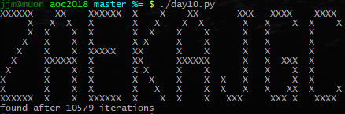

# Advent of Code 2018

Python solutions to [Advent of Code 2018][1]. Pytest is needed to run the tests
as well as my new Pytest plugin **pytest-aoc** ([GitHub][2], [PyPI][3]), to
provide AoC test fixtures to the unit tests.

[1]: https://adventofcode.com/2018
[2]: https://github.com/j0057/pytest-aoc
[3]: https://pypi.org/project/pytest-aoc

## Day 1: Chronal Calibration

_"Starting with a frequency of zero, what is the resulting frequency after all
of the changes in frequency have been applied?"_ – solved with `sum`.

_"What is the first frequency your device reaches twice?"_ – solved with a
while loop, a set and `itertools.cycle`.

## Day 2: Inventory Management System

_"What is the checksum for your list of box IDs?"_ – it only took until day 2
for `collections.Counter` to save the day.

_"What letters are common between the two correct box IDs?"_ – just `zip` and
`max`.

## Day 3: No Matter How You Slice It

_"How many square inches of fabric are within two or more claims?"_ – used a
`collections.defaultdict`.

_"What is the ID of the only claim that doesn't overlap?"_ – used a set of all
claims and removed all claims that were in a coordinate with more than one
claim.

## Day 4: Repose Record

_"Find the guard that has the most minutes asleep. What minute does that guard
spend asleep the most?"_ – first used `itertools.groupby` to make a dict of all
the guards and their minutes, then `max` to find the sleepiest guard, then
`collections.Counter` for the best time.

_"Of all guards, which guard is most frequently asleep on the same minute?"_ –
same as part one but a little different.

_"What is the ID of the guard you chose multiplied by the minute you chose?"_

## Day 5: Alchemical Reduction

_"How many units remain after fully reacting the polymer you scanned?"_ – used
`functools.reduce` with a lambda that's a little too complex.

_"What is the length of the shortest polymer you can produce by removing all
units of exactly one type and fully reacting the result?"_ – same as part one
but with an additional loop over the alphabet.

## Day 6: Chronal Coordinates

_"What is the size of the largest area that isn't infinite?"_ – did some
research on properly calculating [Voronoi diagrams][61], decided that the O(n
log n) solution in [Fortune's Algorithm][62] looked like a lot of hard work,
and went with the naive quadratic solution instead: for each cell, find the
distances to all the points. For n=50, it runs fast enough on a Core i7-7700.

I did like calculating the bounding box using just two `functools.reduce`
statements with `min` and `max`. Also used `collections.Counter` again, as well
as `functools.takewhile`.

_"What is the size of the region containing all locations which have a total
distance to all given coordinates of less than 10000?"_ – not aware of any
algorithms here so went with brute force again.

[61]: https://en.m.wikipedia.org/wiki/Voronoi_diagram
[62]: https://en.m.wikipedia.org/wiki/Fortune%27s_algorithm

## Day 7: The Sum of Its Parts

_"In what order should the steps in your instructions be completed?"_ – this
one was rather painful. I tried [Depth-First Search][71] recursively as well as
iteratively, with the edges pointing from or to the dependencies, and got the
wrong order every time. Found out I wanted a [Topological Sorting][72] instead,
which I implemented using **Kahn's Algorithm**.

At least `itertools.chain` and `itertools.groupby` lessened the pain somewhat.

_"With 5 workers and the 60+ second step durations described above, how long
will it take to complete all of the steps?"_ – said "Fuck it", and hacked at
Kahn's Algorithm until I got the right answer, but off by one. Said "Fuck it"
again, added a `-1` in the code, and AoC accepted the answer. Not my proudest
moment.

Had to drag in `collections.defaultdict` again, to hold extremely hacky lambda
function closures.

[71]: https://en.m.wikipedia.org/wiki/Depth-first_search
[72]: https://en.wikipedia.org/wiki/Topological_sorting

## Day 8: Memory Maneuver

_"What is the sum of all metadata entries?"_ – this was made really easy by
Python's iterators, which can be consumed only once. The recursive Tree
constructor uses `itertools.islice` to pluck values from the iterator.

_"What is the value of the root node?"_ – could basically add the rules without
too much thinking.

## Day 9: Marble Mania

_"What is the winning Elf's score?"_ – pretty straightforward implementation
using a standard list.

_"What would the new winning Elf's score be if the number of the last marble
were 100 times larger?"_ – it turns out using `list.insert` and `list.pop`
doesn't scale due to all the copying. Got referred to the `blist` package that
acts as a fast drop-in replacement for Python's list. That one did get the job
done. It did throw some warnings though and it's not compatible with PyPy, so I
did the work to implement a [Doubly-linked List][91]. I opted for the 'hash
linking' method, which cost me half an hour of pen-and-paper debugging. Also,
it does take a good 5s to run...

Update: The solution from the reddit solution thread using `collections.deque`
runs in 1.05s and reads much cleaner.

[91]: https://en.m.wikipedia.org/wiki/Linked_list#Hash_linking

## Day 10: The Stars Align

_"What message will eventually appear in the sky?"_ – Implemented using an
iterator. No unit tests, so I'll just link a screenshot:

_"Exactly how many seconds would they have needed to wait for that message to
appear?"_ – That's the number of iterations minus two...
